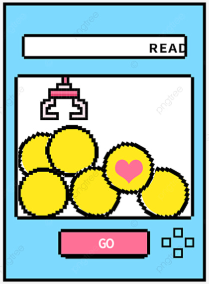
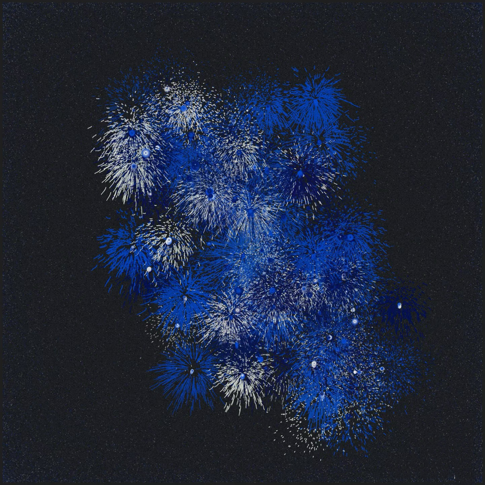
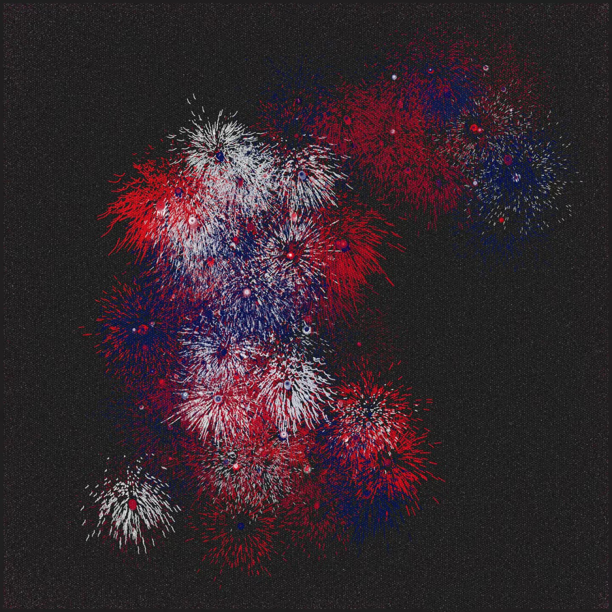
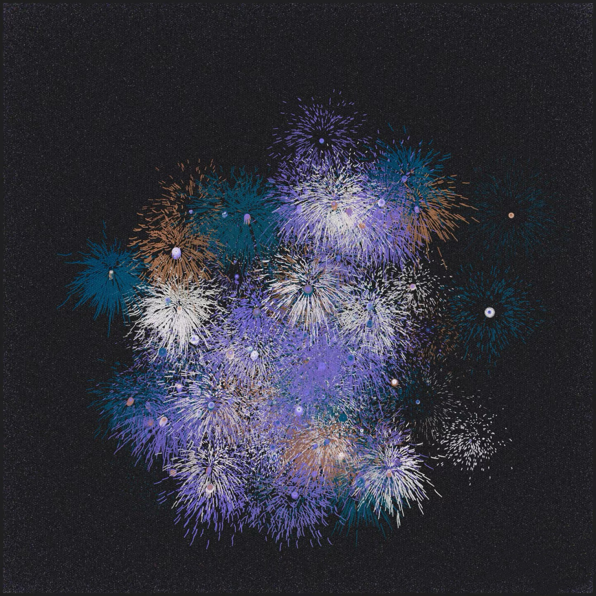
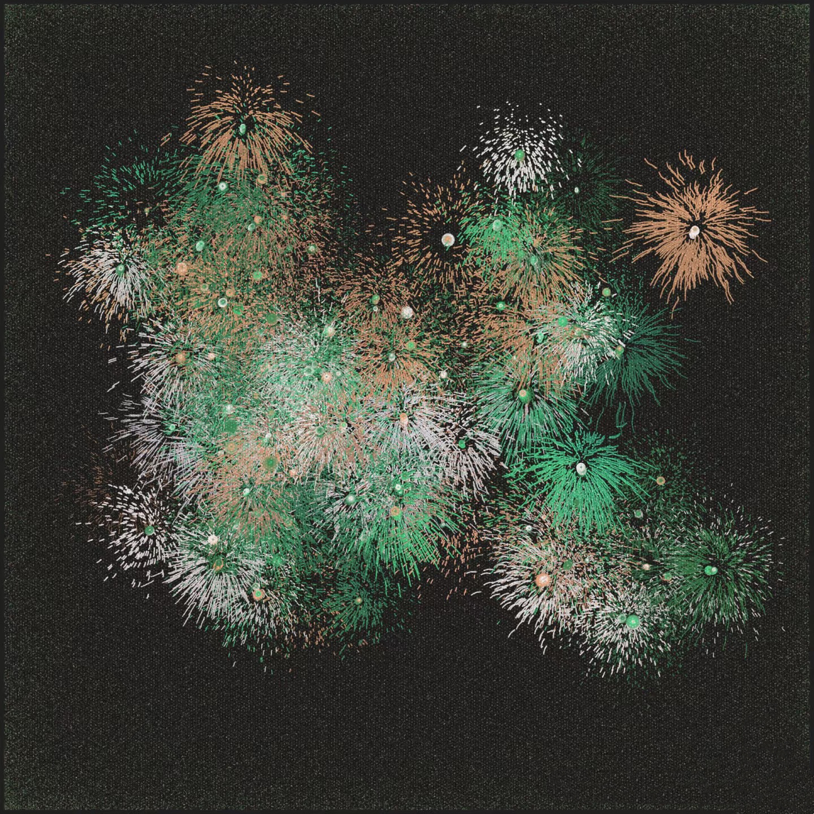

# Milestone 1
## IDEA1 an electronic claw machine


- Use the joystick element to control the gripper on the screen, and then set a button to be pressed to grab downwards.
- I will explore integrating Arduino for controlling the joystick and button inputs, while p5.js handles the visual representation of the claw machine and the objects to grab. 
- Adding some sound effects:
1. **Background Music**


Type: Soft arcade style music that creates a playground atmosphere.
Trigger Time: Played when user starts the game, and looped until the end of the game.

2. **Grabber Movement**


Type: Mechanical sliding sound effect that mimics the sound of a gripper moving on a track.
Trigger Time: When user use joystick to control the gripper.

3. **Button Press**


Type: “click” sound, simulates the sound feedback of a real button.
Trigger: When user presses the gripper button.

4. **Gripper Lowering**


Type: Mechanical arm “click” sound, with metallic texture.
Trigger Time: When the gripper starts to fall.

5. **Successful Grab Sound**


Type: A light victory sound or a short cheer.
Trigger Time: When the gripper successfully grabs an item.

6. **Failed Grab Sound**


Type: A muffled “oops” sound or a humorous miss sound.
Triggered when the grabber fails to grab an item.

## IDEA2 Fireworks & LEDs
### Description
This project combines p5.js visuals with Arduino-based physical computing to create an interactive fireworks display. Users can press buttons to trigger fireworks of different colors on the screen, while corresponding LED lights of the same colors illuminate, creating a synchronized physical-digital experience. 
### Features
- **Fireworks Animation**: Dynamic, colorful fireworks displayed on the screen, created using p5.js.
- **LED Synchronization**: Each firework color is matched with an LED of the same color.
- **Button Inputs**: Physical buttons connected to an Arduino trigger both the on-screen fireworks and corresponding LEDs.
- **Interactive Design**: Users control the experience by pressing buttons to "launch" fireworks.
### Fireworks





## IDEA3 Music Visualization

This is a README file that can be used to describe and document your assignment.

Markdown Cheatsheet (from [https://www.markdownguide.org/cheat-sheet/](https://www.markdownguide.org/cheat-sheet/)):

---
---

# Heading1
## Heading2
### Heading3
#### Heading4
##### Heading5
###### Heading6

**bold text**

*italicized text*

~~strikethrough text~~

Ordered List:
1. First item
2. Second item
3. Third item

Unordered List:
- First item
- Second item
- Third item

`short code block`

```
extended code block
fun() {
  return 0
}
```

Link:  
[linked text](https://www.example.com)


Image with url:  


Image on repo:  


To start a new line, add two spaces at the end of a line, like this:  
this is a new line.


To start a new paragraph, leave an empty line between two lines of text.

This is a new paragraph.
