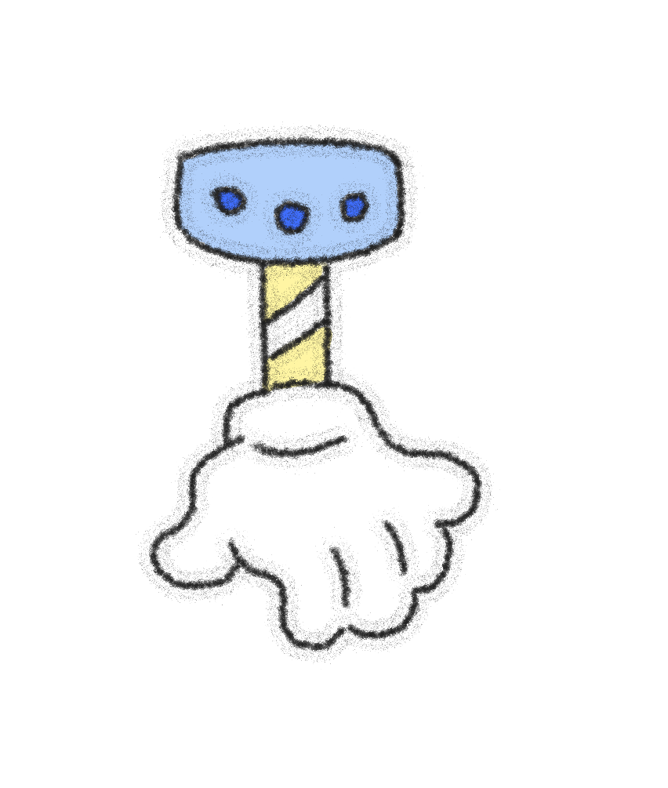

# Milestone 2
## Project Proposal, Planning and Organizing

### Hight-level system diagram
1. **Arduino Tasks**:
- Read joystick inputs (up and down (there may be no up and down, the 2D interface only needs to control left and right), left and right).
- Detects a button press (triggers a grab).
- Sends data to computer via Serial communication.
2. **p5.js Tasks**:
- Controls the position and movement of the claw based on Arduino data.

- Picture of a crane machine.  
I draw it with Procreate.


- Display Score.

### Circuit diagram
1. **Components**:
- One joystick (4-way).
- One button (Grab action trigger).
2. **Connections**:
- The Arduino's digital inputs are used to read button and joystick signals.
- Power and Ground circuits.
- Optional: Serial communication wiring.


### External data or library
p5.js Libraries:
**p5.serialport**: Used to communicate between Arduino and p5.js.  
**p5.js Sound Library**:to play many of the sound effects I proposed in milestone1.

### Sensor, Output Component or Mechanism
- Joystick: Controls the claw position.
- Button: Controls the gripping action.


### Reference images, texts and projects
- Images of real crane grabbers and how they work.

- Online interactive crane-catching game projects.

[claw fish-youtube](https://www.youtube.com/watch?v=3sogBNn3INg)
[claw fish-itch.io](https://davidczar.itch.io/clawfish)

### Plan for User Testing
1. Target Users:
Users interested in interactive games, possibly students or regular gamers.
2. Test Method:
- Observe the way users use the joystick and buttons.
- Record the success rate of the user in completing the “grabbing” task.
- Gather feedback: whether the operation of the crane machine is smooth and interesting.

### Short discussion of why my project is relevant:：
- Relation to Readings:
Douglas Rushkoff’s command: Explore the possibilities of new user interfaces.
Chris Crawford’s interactivity: Whether user input (joystick/buttons) can lead to meaningful feedback.
- Connection to Society:
A look at how classic games can be revitalized through new technologies.
- Personal Importance:
Share an interest in game development.  
Explore the combination of electronic hardware and software.

### Pseudocode
- Arduino:
```
// Read joystick data
xValue = analogRead(xPin);
yValue = analogRead(yPin);
// Detect button pressed
buttonState = digitalRead(buttonPin);
// Send data to p5.js
Serial.print(xValue);
Serial.print(",");
Serial.print(yValue);
Serial.print(",");
Serial.println(buttonState);
```
- p5.js:
```
// Receiving data from Arduino
function serialEvent() {
    let data = serial.readLine();
    let values = split(data, ',');
    if (values.length === 3) {
        let x = int(values[0]);
        let y = int(values[1]);
        let button = int(values[2]);
        // Update the position and status of the claws
    }
}
```


# Milestone 1
## IDEA1 An Electronic Claw Machine


- Use the joystick element to control the gripper on the screen, and then set a button to be pressed to grab downwards.
- I will explore integrating Arduino for controlling the joystick and button inputs, while p5.js handles the visual representation of the claw machine and the objects to grab. 
- Adding some sound effects:
1. **Background Music**  
Type: Soft arcade style music that creates a playground atmosphere.
Trigger Time: Played when user starts the game, and looped until the end of the game.  
2. **Grabber Movement**  
Type: Mechanical sliding sound effect that mimics the sound of a gripper moving on a track.  
Trigger Time: When user use joystick to control the gripper.  
3. **Button Press**  
Type: “click” sound, simulates the sound feedback of a real button.  
Trigger: When user presses the gripper button.  
4. **Gripper Lowering**  
Type: Mechanical arm “click” sound, with metallic texture.  
Trigger Time: When the gripper starts to fall.  
5. **Successful Grab Sound**  
Type: A light victory sound or a short cheer.  
Trigger Time: When the gripper successfully grabs an item.  
6. **Failed Grab Sound**  
Type: A muffled “oops” sound or a humorous miss sound.  
Triggered when the grabber fails to grab an item.  
## IDEA2 Fireworks & LEDs
### Description
This project combines p5.js visuals with Arduino-based physical computing to create an interactive fireworks display. Users can press buttons to trigger fireworks of different colors on the screen, while corresponding LED lights of the same colors illuminate, creating a synchronized physical-digital experience. 

### Features
- **Fireworks Animation**: Dynamic, colorful fireworks displayed on the screen, created using p5.js.
- **LED Synchronization**: Each firework color is matched with an LED of the same color.
- **Button Inputs**: Physical buttons connected to an Arduino trigger both the on-screen fireworks and corresponding LEDs.
- **Interactive Design**: Users control the experience by pressing buttons to "launch" fireworks.


## IDEA3 Music Visualization with Synced LEDs
**LED Feedback for Synced Effects**  
- Usage: Synchronize LEDs with the music's beat or visualization effects.  
- LEDs could blink or pulse with the bassline or other key features of the music.LED 
**Implementation**  
p5.js analyzes the audio, identifies beats, and sends signals back to Arduino to control LED patterns.p5.js